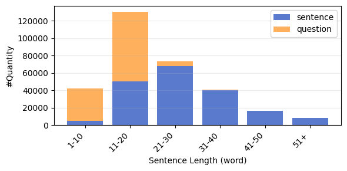
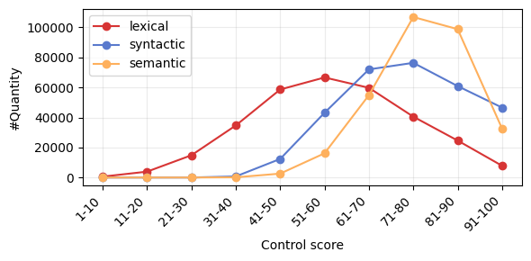

# Tuần 4

Báo cáo này trình bày tiến độ đánh giá các các mô hình đánh giá chất lượng paraphrase

| Model           | LR   | Q-MAE_lex | Q-MAE_syn | Q-MAE_sem | S-MAE_lex | S-MAE_syn | S-MAE_sem | Q Avg | S Avg | All Avg |
|-----------------|------|-----------|-----------|-----------|-----------|-----------|-----------|-------|-------|---------|
| PhoBERT-base    | 1e-5 | 16.37 | 15.21 | 14.38 | 5.18  | 11.37 | 2.79 | 15.32 | 6.45 | 10.88 |
| PhoBERT-base    | 3e-5 | 16.15 | 11.97 | 9.86  | 1.03  | 7.77  | 1.92 | 12.66 | 3.57 | 8.12  |
| PhoBERT-base    | 5e-5 | 16.15 | 11.97 | 9.86  | 12.06 | 10.95 | 7.21 | 12.66 | 10.08| 11.37 |
| vELECTRA-base   | 1e-5 | 1.53  | 5.61  | 2.78  | 1.52  | 7.81  | 3.15 | 3.31  | 4.16 | 3.73  |
| vELECTRA-base   | 3e-5 | 1.48  | 4.01  | 2.45  | 1.13  | 5.87  | 2.66 | 2.65  | 3.22 | 2.93  |
| vELECTRA-base   | 5e-5 | 1.72  | 3.85  | 2.53  | 1.37  | 5.71  | 2.87 | 2.70  | 3.32 | 3.01  |
| XLM-R           | 1e-5 | 16.30 | 15.56 | 13.86 | 7.16  | 11.34 | 3.32 | 15.24 | 7.27 | 11.26 |
| XLM-R           | 3e-5 | 16.02 | 11.94 | 9.71  | 8.68  | 11.15 | 4.63 | 12.56 | 8.15 | 10.36 |
| XLM-R           | 5e-5 | 16.15 | 11.97 | 9.86  | 10.50 | 11.37 | 6.04 | 12.66 | 9.30 | 10.98 |

Note: Q: ViQPC-Question, S: ViQPC-Sentence

# Xây dựng bộ dữ liệu ViQPC

Link truy cập: [Hugginface](https://huggingface.co/datasets/ngwgsang/ViQPC)

**Note:** Bộ dữ liệu nguồn gồm các cặp câu hỏi–câu trả lời, với tổng cộng 250K cặp dùng cho huấn luyện và 50K cặp dùng cho kiểm thử. Các cặp câu được gán nhãn tự động bằng các giá trị từ 0–100 theo ba trục đánh giá được đề xuất (lexical, syntactic và semantic).

### Kết quả thực nghiệm lần 1

| Model | ViQP BLEU | ViQP chrF | ViQP BERT | ViQP Jac | ViQP TED | ViQP POS | ViSP BLEU | ViSP chrF | ViSP BERT | ViSP Jac | ViSP TED | ViSP POS | vnPara BLEU | vnPara chrF | vnPara BERT | vnPara Jac | vnPara TED | vnPara POS |
|------|-----------|-----------|-----------|----------|----------|----------|-----------|-----------|-----------|----------|----------|----------|-------------|-------------|-------------|------------|------------|------------|
| BARTpho-syllable | 68.39 | 58.58 | 86.87 | 62.45 | 17.80 | 5.0 | 80.37 | **64.77** | 75.48 | 68.18 | 21.24 | 3.0 | **60.73** | **69.05** | 68.96 | 93.06 | 3.38 | 1.0 |
| BARTpho-word | 56.80 | 57.99 | 76.10 | 51.94 | 19.41 | 6.0 | 69.11 | 64.19 | 72.85 | 62.51 | 17.26 | 2.0 | 47.14 | 59.08 | 64.00 | 75.30 | 9.62 | **2.0** |
| ViT5-base | 76.29 | 62.43 | 85.67 | 69.09 | 14.93 | 4.0 | 82.80 | 64.54 | 88.85 | 71.30 | 20.09 | 3.0 | 58.00 | 67.96 | 69.14 | 92.97 | 3.34 | 1.0 |
| ViT5-large | 72.08 | 60.89 | 88.06 | 65.01 | 17.55 | 5.0 | 61.88 | 62.57 | 73.32 | 73.97 | 24.58 | 2.0 | 51.38 | 63.69 | 66.65 | 83.45 | 7.81 | 1.0 |
| mBART-large-50 | 82.78 | 64.66 | 88.95 | 75.39 | 13.73 | 4.0 | 88.56 | 64.64 | 79.51 | 82.93 | 11.99 | 2.0 | 56.51 | 66.34 | 68.43 | 88.28 | 5.60 | 1.0 |
| **VietQuill** | **87.26** | **66.69** | **95.28** | **41.32** | **27.27** | **9.0** | 83.18 | 58.97 | **92.65** | **55.56** | **28.13** | **4.0** | 34.00 | 61.04 | **72.59** | **62.82** | **16.89** | **2.0** |

Bảng trên trình bày kết quả đánh giá trên ba bộ dữ liệu chuẩn: **ViQP**, **ViSP** và **vnPara**.  
Các mô hình được so sánh theo hai nhóm chỉ số: **Similarity** (BLEU, chrF, BERTScore) nhằm đo mức độ bảo toàn ngữ nghĩa, và **Diversity** (Jaccard, TED, POS divergence) nhằm đo mức độ đa dạng về cấu trúc và từ vựng.

Kết quả cho thấy **VietQuill** đạt **state-of-the-art (SOTA)** trên cả ba bộ dữ liệu, đặc biệt vượt trội ở các chỉ số **BERTScore** và các thước đo đa dạng. Điều này cho thấy mô hình có khả năng tạo paraphrase vừa **giữ nguyên ý nghĩa gốc** vừa **tăng cường biến đổi cấu trúc và biểu đạt**, giúp cải thiện sự cân bằng giữa similarity và diversity so với các mô hình baseline.