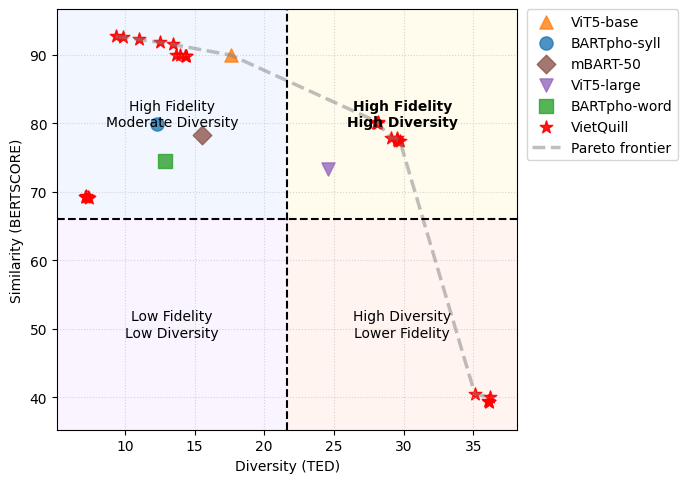
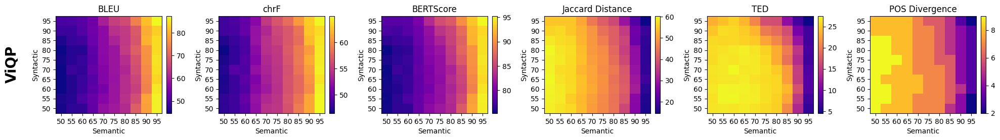
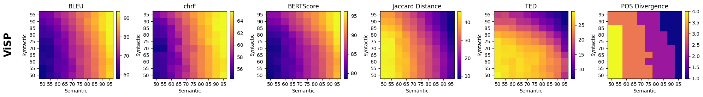
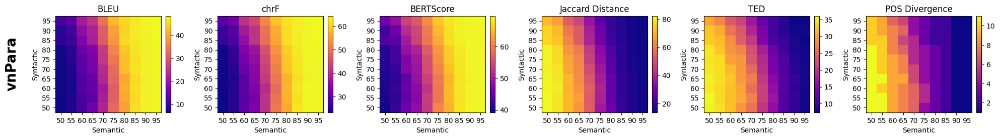

# Similarity–Diversity Analysis & Control Configuration

## 1. Similarity–Diversity Trade-off Analysis

Trong bài toán sinh paraphrase, luôn tồn tại sự đánh đổi giữa:
- Semantic Similarity (độ tương đồng ngữ nghĩa)
- Lexical/Structural Diversity (tính đa dạng)

### Phương pháp
Nhóm trực quan hóa đầu ra của các mô hình trong không gian similarity–diversity bằng:
- BERTScore → đo độ bảo toàn ngữ nghĩa  
- Tree Edit Distance (TED) → đo độ khác biệt cấu trúc  

### Quan sát chính

- Các mô hình baseline:
  - BARTpho-syll
  - mBART-50
  - BARTpho-word  

  → Phân bố trong vùng hẹp:
  - TED: ~12–18  
  - BERTScore: ~74–80  

  → Hành vi: rewrite bảo thủ, ưu tiên giữ nguyên nghĩa

- VietQuill:
  - Bao phủ không gian rộng:
    - High fidelity: >90% BERTScore, TED ~10–15  
    - High diversity: >30 TED, ~78% BERTScore  

  → Hành vi: linh hoạt nhiều mức trade-off

### Kết luận
VietQuill có thể sinh paraphrase ở nhiều chế độ similarity–diversity khác nhau, không bị cố định tại một điểm.

---

## 2. Control Configuration Selection

### Metrics sử dụng
- BLEU  
- chrF  
- BERTScore  
- Jaccard similarity  
- Tree Edit Distance (TED)  
- POS divergence  

### Normalization

Áp dụng min–max normalization:

m_hat_i = (m_i - min(m)) / (max(m) - min(m))

### Aggregated Scores

- Similarity-oriented:

S_sim = (BLEU + chrF + BERTScore) / 3

- Diversity-oriented:

S_div = (Jaccard^-1 + TED + POSDiv) / 3

(Lưu ý: tất cả metrics đã được normalize trước khi tính)

### Selection Strategy

- Nếu mục tiêu là similarity → maximize S_sim  
- Nếu mục tiêu là diversity → maximize S_div  

Cấu hình tối ưu = cấu hình có aggregated score cao nhất theo mục tiêu.

---
### Kết quả optimze

